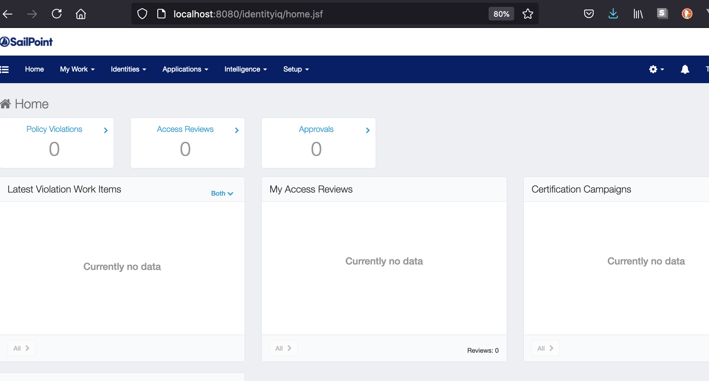

#  Docker for Sailpoint

This will create a database and app container based on the vendor binary.  

This uses the 8.1 version of the binary.  It will look for a file called identityiq.war in the root of this directory to do work.  Please place it there before you do anything.  

## Create the docker network

docker network create --driver bridge sp-net

## Create and run the db

    docker build  --no-cache  -t sp-db -f Dockerfile.db .   
    docker run -d --name=sp-db --publish=3306:3306  --network sp-net  sp-db:latest   

## Run the app

    docker build  --no-cache  --network=host -t sp-app -f Dockerfile.app .  
    docker run -it --name=sp-app --publish=8080:8080  --network sp-net  sp-app:latest   

## login  

http://localhost:8080/identityiq  
spadmin/admin

## Clean up 

    docker container stop sp-app
    docker container rm sp-app
    docker container stop sp-db
    docker container rm sp-db
    docker network rm sp-net

## Other useful urls

[sp install documentation] (https://community.sailpoint.com/t5/IdentityIQ-Product-Guides/8-1-IdentityIQ-Installation-Guide/ta-p/158181)

